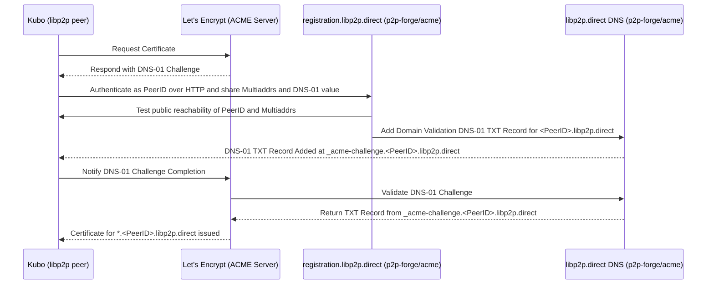
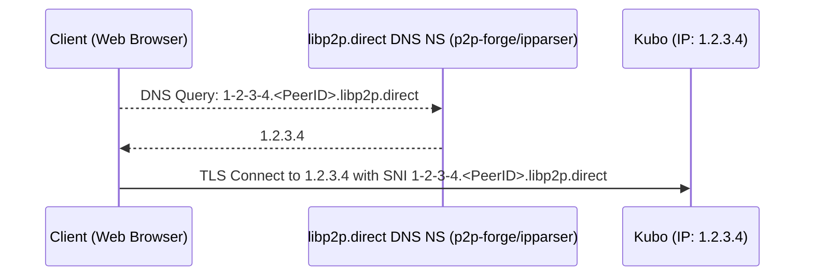

# p2p-forge


> An Authoritative DNS server and HTTP+libp2p API for distributing DNS subdomains with CA-signed TLS certificates to libp2p peers.

<a href="http://ipshipyard.com/"></a>
This repository includes golang client and the backend of AutoTLS feature (see [blog.libp2p.io/autotls](https://blog.libp2p.io/autotls/) and [`AutoTLS` in Kubo](https://github.com/ipfs/kubo/blob/master/docs/config.md#autotls).  
A public utility instance for libp2p at `libp2p.direct` is maintained by [Interplanetary Shipyard](https://github.com/ipshipyard).

- [High-level Design](#high-level-design)
  - [Peer Authentication and DNS-01 Challenge and Certificate Issuance](#peer-authentication-and-dns-01-challenge-and-certificate-issuance)
  - [DNS Resolution and TLS Connection](#dns-resolution-and-tls-connection)
- [Build](#build)
- [Install](#install)
  - [From source](#from-source)
- [Usage](#usage)
  - [Local testing](#local-testing)
  - [Docker](#docker)
  - [Configuration](#configuration)
    - [ipparser Syntax](#ipparser-syntax)
    - [acme Syntax](#acme-syntax)
  - [Example](#example)
  - [Handled DNS records](#handled-dns-records)
    - [IPv4 subdomain handling](#ipv4-subdomain-handling)
    - [IPv6 subdomain handling](#ipv6-subdomain-handling)
  - [Submitting Challenge Records](#submitting-challenge-records)
  - [Health Check](#health-check)

## High-level Design

The following diagrams show the high-level design of how p2p-forge works.

### Peer Authentication and DNS-01 Challenge and Certificate Issuance



- DNS TXT record at `_acme-challenge.<peerid>.libp2p.direct` is part of [ACME DNS-01 Challenge](https://letsencrypt.org/docs/challenge-types/#dns-01-challenge)
- HTTP API at `/v1/_acme-challenge`  is provided by [p2p-forge/acme](https://github.com/ipshipyard/p2p-forge/tree/main/acme) and requires [libp2p node and a valid PeerID](https://docs.libp2p.io/concepts/fundamentals/peers/) to pass PeerID auth and libp2p connectivity challenge.
- Golang client for this entire flow is provided in [p2p-forge/client](https://github.com/ipshipyard/p2p-forge/tree/main/client)

### DNS Resolution and TLS Connection



- DNS A/AAA responses for `*.<PeerID>.libp2p.direct` are  handled by [p2p-forge/ipparser](https://github.com/ipshipyard/p2p-forge/tree/main/ipparser)
- TLS with [SNI](https://en.wikipedia.org/wiki/Server_Name_Indication) is how web browsers establish [libp2p WebSockets transport](https://github.com/libp2p/specs/blob/master/websockets/README.md) connection

## Build

`go build` will build the `p2p-forge` binary in your local directory

## Install

```console
$ go install github.com/ipshipyard/p2p-forge@latest
```

Will download using go mod, build and install the binary in your global Go binary directory (e.g. `~/go/bin`)

### From source

`go install` will build and install the `p2p-forge` binary in your global Go binary directory (e.g. `~/go/bin`)

## Usage

### Local testing

Build and run a custom Corefile configuration and on custom ports (DNS port set to `5354` via CLI, HTTP port set to `5380` via custom Corefile):

```console
$ ./p2p-forge -conf Corefile.local-dev -dns.port 5354
```

Test with `dig`:

```console
$ dig A 1-2-3-4.k51qzi5uqu5dlwfht6wwy7lp4z35bgytksvp5sg53fdhcocmirjepowgifkxqd.libp2p.direct @localhost -p 5354
1.2.3.4

$ curl http://localhost:5380/v1/health -I
HTTP/1.1 204 No Content
```

To run on port `53` as non-root user, adjust permission:

```console
$ sudo setcap cap_net_bind_service=+ep /path/to/p2p-forge
```

### Docker

Prebuilt images for `main` and `staging` branches are provided at https://github.com/ipshipyard/p2p-forge/pkgs/container/p2p-forge

Docker image ships without `/p2p-forge/Corefile` and `/p2p-forge/zones`, and you need to pass your own:

```console
$ docker build -t p2p-forge . && docker run --rm -it --net=host -v ./Corefile:/p2p-forge/Corefile.example -v ./zones:/p2p-forge/zones p2p-forge -conf /p2p-forge/Corefile.example -dns.port 5353
```

Test with `dig`:

```console
$ dig A 1-2-3-4.k51qzi5uqu5dlwfht6wwy7lp4z35bgytksvp5sg53fdhcocmirjepowgifkxqd.libp2p.direct @localhost -p 5353
1.2.3.4
```

### Configuration

This binary is based on [CoreDNS](https://github.com/coredns/coredns) which is itself based on Caddy.
To run the binary create a file `Corefile` following the syntax listed in the CoreDNS documentation.

A custom configuration can be passed via `./p2p-forge -conf Corefile.example`

This binary introduces two additional plugins:
- `ipparser` which handles returning A and AAAA records for domains like `<encoded-ip-address>.<peerID>.libp2p.direct`
- `acme` which handles reading and writing DNS acme challenges for domains like `_acme-challenge.<peerID>.libp2p.direct`

#### ipparser Syntax

~~~
ipparser FORGE_DOMAIN
~~~

**FORGE_DOMAIN** the domain of the forge (e.g. libp2p.direct)

#### acme Syntax

~~~
acme FORGE_DOMAIN {
	[registration-domain REGISTRATION_DOMAIN [listen-address=ADDRESS] [external-tls=true|false]
	[database-type DB_TYPE [...DB_ARGS]]
}
~~~

- **FORGE_DOMAIN** the domain suffix of the forge (e.g. `libp2p.direct`)
- **REGISTRATION_DOMAIN** the HTTP API domain used by clients to send requests for setting ACME challenges (e.g. `registration.libp2p.direct`)
   - **ADDRESS** is the address and port for the internal HTTP server to listen on (e.g. :1234), defaults to `:443`.
   - `external-tls` should be set to `true` if the TLS termination (and validation of the registration domain name) will happen externally or should be handled locally, defaults to false
- **DB_TYPE** is the type of the backing database used for storing the ACME challenges. Options include:
  - `dynamo TABLE_NAME` for production-grade key-value store shared across multiple instances (where all credentials are set via AWS' standard environment variables: `AWS_REGION`, `AWS_ACCESS_KEY_ID`, `AWS_SECRET_ACCESS_KEY`)
  - `badger DB_PATH` for local key-value store (good for local development and testing)

### Example

Below is a basic example of starting a DNS server that handles the IP based domain names as well as ACME challenges.
It does the following:
- Handles IP-based names and ACME challenges for the libp2p.direct forge
- Sets up a standard HTTPS listener for registration.libp2p.direct to handle setting ACME challenges
- Uses dynamo as a backend for ACME challenges

``` corefile
. {
    log
    ipparser libp2p.direct
    acme libp2p.direct {
        registration-domain registration.libp2p.direct listen-address=:443 external-tls=false
        database-type dynamo mytable
    }
}
```

### Handled DNS records

There are 3 types of records handled for a given peer and forge (e.g. `<peerID>.libp2p.direct`):
- ACME Challenges for a given peerID `_acme-challenge.<peerID>.libp2p.direct`
- A records for an IPv4 prefixed subdomain like `1-2-3-4.<peerID>.libp2p.direct`
- AAAA records for an IPv6 prefixed subdomain like `2001-db8--.<peerID>.libp2p.direct`

#### IPv4 subdomain handling

IPv4 handling is fairly straightforward, for a given IPv4 address `1.2.3.4` convert the `.`s into `-`s and the result
will be valid.

#### IPv6 subdomain handling

Due to the length of IPv6 addresses there are a number of different formats for describing IPv6 addresses.

The addresses handled here are:
- For an address `A:B:C:D:1:2:3:4` convert the `:`s into `-`s and the result will be valid.
- Addresses of the form `A::C:D` can be converted either into their expanded form or into a condensed form by replacing
the `:`s with `-`s, like `A--C-D`
- When there is a `:` as the first or last character it must be converted to a 0 to comply with [rfc1123](https://datatracker.ietf.org/doc/html/rfc1123#section-2)
, so `::B:C:D` would become `0--B-C-D` and `1::` would become `1--0`

Other address formats (e.g. the dual IPv6/IPv4 format) are not supported

### Submitting Challenge Records

To claim a domain name like `<peerID>.libp2p.direct` requires:
1. The private key corresponding to the given peerID
2. A publicly reachable libp2p endpoint with 
   - one of the following libp2p transport configurations:
     - QUIC-v1
     - TCP or WS or WSS, Yamux, TLS or Noise
     - WebTransport
     - Other transports are under consideration (e.g. HTTP), if they are of interest please file an issue
   - the [Identify protocol](https://github.com/libp2p/specs/tree/master/identify) (`/ipfs/id/1.0.0`)

To set an ACME challenge send an HTTP request to the server (for libp2p.direct this is registration.libp2p.direct)
```shell
curl -X POST "https://registration.libp2p.direct/v1/_acme-challenge" \
-H "Authorization: libp2p-PeerID bearer=\"<base64-encoded-opaque-blob>\""
-H "Content-Type: application/json" \
-d '{
  "Value": "your_acme_challenge_token",
  "Addresses": ["your", "multiaddrs"]
}'
```

Where the bearer token is derived via the [libp2p HTTP PeerID Auth Specification](https://github.com/libp2p/specs/blob/master/http/peer-id-auth.md).

### Health Check

`/v1/health` will always respond with HTTP 204

