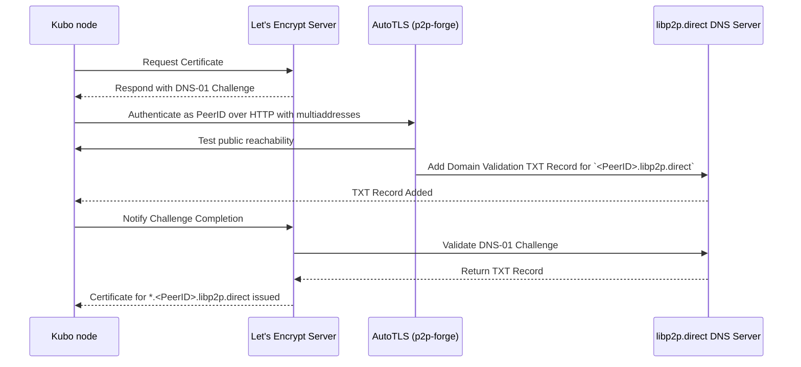
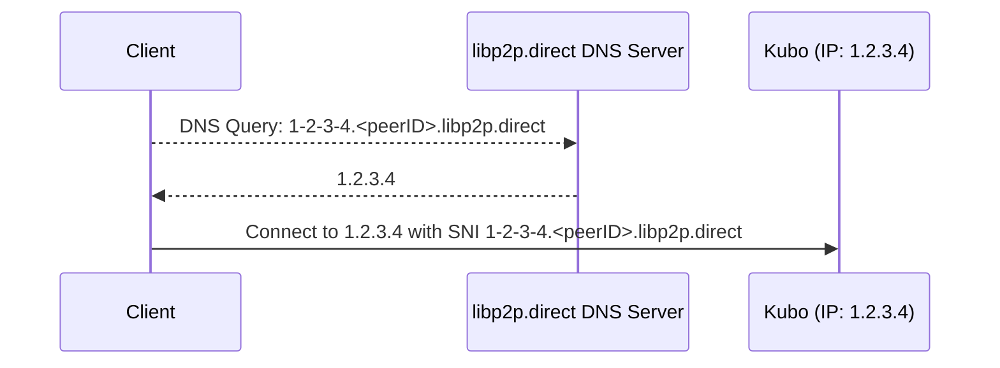

# p2p-forge

> An Authoritative DNS server for distributing DNS subdomains to libp2p peers.
> 
> This is the backend of [`AutoTLS` feature introduced in Kubo 0.32.0-rc1](https://github.com/ipfs/kubo/blob/master/docs/config.md#autotls).

## High-level Design

The following diagrams show the high-level design of how p2p-forge works.

### Peer Authentication and DNS-01 Challenge and Certificate Issuance



### DNS Resolution




## Build

`go build` will build the `p2p-forge` binary in your local directory

## Install

```console
$ go install github.com/ipshipyard/p2p-forge@latest
```

Will download using go mod, build and install the binary in your global Go binary directory (e.g. `~/go/bin`)

### From source

`go install` will build and install the `p2p-forge` binary in your global Go binary directory (e.g. `~/go/bin`)

## Usage

### Local testing

Build and run on custom port:

```console
$ ./p2p-forge -dns.port 5353
$ docker build -t p2p-forge . && docker run --rm -it --net=host p2p-forge -dns.port 5353
```

Test with `dig`:

```console
$ dig A 1-2-3-4.k51qzi5uqu5dlwfht6wwy7lp4z35bgytksvp5sg53fdhcocmirjepowgifkxqd.libp2p.direct @localhost -p 5353
1.2.3.4
```

### Configuration

This binary is based on [CoreDNS](https://github.com/coredns/coredns) which is itself based on Caddy.
To run the binary create a file `Corefile` following the syntax listed in the CoreDNS documentation.

A custom configuration can be passed via `./p2p-forge -conf Corefile.example`

This binary introduces two additional plugins:
- `ipparser` which handles returning A and AAAA records for domains like `<encoded-ip-address>.<peerID>.libp2p.direct`
- `acme` which handles reading and writing DNS acme challenges for domains like `_acme-challenge.<peerID>.libp2p.direct`

#### ipparser Syntax

~~~
ipparser FORGE_DOMAIN
~~~

**FORGE_DOMAIN** the domain of the forge (e.g. libp2p.direct)

#### acme Syntax

~~~
acme FORGE_DOMAIN {
	[registration-domain REGISTRATION_DOMAIN [listen-address=ADDRESS] [external-tls=true|false]
	[database-type DB_TYPE [...DB_ARGS]]
}
~~~

- **FORGE_DOMAIN** the domain of the forge (e.g. libp2p.direct)
- **REGISTRATION_DOMAIN** the domain used by clients to send requests for setting ACME challenges (e.g. registration.libp2p.direct)
   - **ADDRESS** is the address and port for the internal HTTP server to listen on (e.g. :1234), defaults to `:443`.
   - external-tls should be set to true if the TLS termination (and validation of the registration domain name) will happen externally or should be handled locally, defaults to false
- **DB_TYPE** is the type of the backing database used for storing the ACME challenges. Options include:
    - dynamo TABLE_NAME (where all credentials are set via AWS' standard environment variables)
    - badger DB_PATH

### Example

Below is a basic example of starting a DNS server that handles the IP based domain names as well as ACME challenges.
It does the following:
- Handles IP-based names and ACME challenges for the libp2p.direct forge
- Sets up a standard HTTPS listener for registration.libp2p.direct to handle setting ACME challenges
- Uses dynamo as a backend for ACME challenges

``` corefile
. {
    log
    ipparser libp2p.direct
    acme libp2p.direct {
        registration-domain registration.libp2p.direct listen-address=:443 external-tls=false
        database-type dynamo mytable
    }
}
```

### Handled DNS records

There are 3 types of records handled for a given peer and forge (e.g. `<peerID>.libp2p.direct`):
- ACME Challenges for a given peerID `_acme-challenge.<peerID>.libp2p.direct`
- A records for an IPv4 prefixed subdomain like `1-2-3-4.<peerID>.libp2p.direct`
- AAAA records for an IPv6 prefixed subdomain like `2001-db8--.<peerID>.libp2p.direct`

#### IPv4 subdomain handling

IPv4 handling is fairly straightforward, for a given IPv4 address `1.2.3.4` convert the `.`s into `-`s and the result
will be valid.

#### IPv6 subdomain handling

Due to the length of IPv6 addresses there are a number of different formats for describing IPv6 addresses.

The addresses handled here are:
- For an address `A:B:C:D:1:2:3:4` convert the `:`s into `-`s and the result will be valid.
- Addresses of the form `A::C:D` can be converted either into their expanded form or into a condensed form by replacing
the `:`s with `-`s, like `A--C-D`
- When there is a `:` as the first or last character it must be converted to a 0 to comply with [rfc1123](https://datatracker.ietf.org/doc/html/rfc1123#section-2)
, so `::B:C:D` would become `0--B-C-D` and `1::` would become `1--0`

Other address formats (e.g. the dual IPv6/IPv4 format) are not supported

### Submitting Challenge Records

To claim a domain name like `<peerID>.libp2p.direct` requires:
1. The private key corresponding to the given peerID
2. A publicly reachable libp2p endpoint with 
   - one of the following libp2p transport configurations:
     - QUIC-v1
     - TCP or WS or WSS, Yamux, TLS or Noise
     - WebTransport
     - Other transports are under consideration (e.g. HTTP), if they are of interest please file an issue
   - the [Identify protocol](https://github.com/libp2p/specs/tree/master/identify) (`/ipfs/id/1.0.0`)

To set an ACME challenge send an HTTP request to the server (for libp2p.direct this is registration.libp2p.direct)
```shell
curl -X POST "https://registration.libp2p.direct/v1/_acme-challenge" \
-H "Authorization: libp2p-PeerID bearer=\"<base64-encoded-opaque-blob>\""
-H "Content-Type: application/json" \
-d '{
  "value": "your_acme_challenge_token",
  "addresses": ["your", "multiaddrs"]
}'
```

Where the bearer token is derived via the [libp2p HTTP PeerID Auth Specification](https://github.com/libp2p/specs/blob/master/http/peer-id-auth.md).
