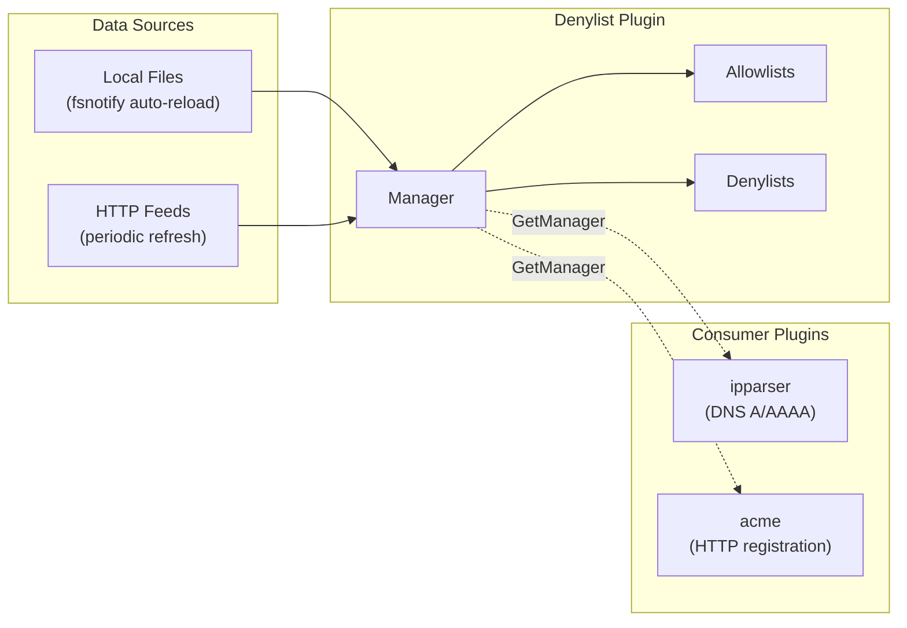
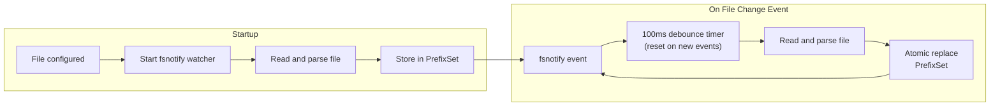
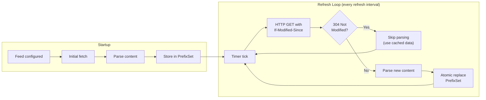
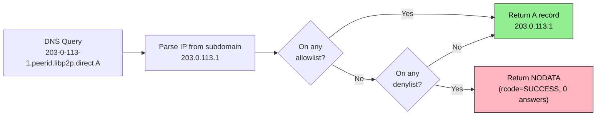
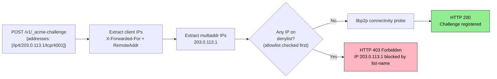

# IP Denylist

The denylist plugin prevents misuse of the public DNS and ACME registration services for malicious purposes such as DNS rebinding attacks, malware distribution, or phishing.

> [!TIP]
> The easiest way to block an IP abusing the p2p-forge service is to report it to one of the [recommended feeds](#recommended) (e.g., URLhaus or Spamhaus).

## Table of Contents

- [Overview](#overview)
- [Configuration](#configuration)
  - [File Directive](#file-directive)
  - [Feed Directive](#feed-directive)
  - [Parsing](#parsing)
  - [Example](#example)
- [How It Works](#how-it-works)
  - [DNS (ipparser)](#dns-ipparser)
  - [ACME Registration](#acme-registration)
- [Feeds](#feeds)
  - [Recommended](#recommended)
  - [Other (Not Enabled by Default)](#other-not-enabled-by-default)

## Overview

The denylist is a standalone CoreDNS plugin shared by:

- **ipparser**: Blocks DNS responses for denied IPs (returns NODATA)
- **acme**: Blocks ACME certificate registration for denied client IPs or multiaddr IPs (returns HTTP 403)



The denylist system:

- Supports both **file-based** lists (auto-reload on change via fsnotify)
- Supports **HTTP feed-based** lists (auto-refresh with `If-Modified-Since` caching)
- Allows both **allow** and **deny** list types (allowlists are checked first)
- Provides Prometheus metrics for monitoring (see [METRICS.md](METRICS.md))

## Configuration

The denylist is configured as a top-level plugin in the Corefile:

```
denylist {
    file <path> [type=allow|deny] [name=<name>]
    feed <url> format=ip|url [type=allow|deny] [refresh=<duration>] [name=<name>]
}
ipparser libp2p.direct
acme libp2p.direct { ... }
```

### File Directive

Loads IP addresses from a local file. The file is watched for changes and automatically reloaded.

```
file <path> [type=allow|deny] [name=<name>]
```

Options:

- `path` - File path (absolute or relative to Corefile directory)
- `type` - List type: `allow` or `deny` (default: `deny`)
- `name` - Name for metrics (default: filename)

File format: One IP or CIDR per line. Lines starting with `#` or `;` are comments.

```
# Example denylist
203.0.113.0/24
198.51.100.0/24
2001:db8::/32
```

#### File Watching Behavior

Files are monitored via fsnotify and automatically reloaded when changed:

- Watcher starts at plugin initialization
- Changes trigger a 100ms debounce timer (reset on new events) to handle editors that perform multiple writes
- After debounce, file is re-read and parsed
- Updates are atomic (no partial state during reload)



### Feed Directive

Fetches IP addresses from an HTTP URL. Supports periodic refresh with `If-Modified-Since` caching.

```
feed <url> format=ip|url [type=allow|deny] [refresh=<duration>] [name=<name>]
```

Options:

- `url` - HTTP(S) URL to fetch
- `format` - Content format (required):
  - `ip` - One IP or CIDR per line (e.g., Spamhaus DROP)
  - `url` - One URL per line; IPs extracted from hostnames (e.g., URLhaus). The parser extracts IPs directly from URL hostnames. Domain names are skipped (DNS resolution is not performed to avoid stale results and collateral damage from shared hosting). This means most URLhaus entries (which use domain names) won't match unless they target forge domains or use IP addresses as hosts directly.
- `type` - List type: `allow` or `deny` (default: `deny`)
- `refresh` - Refresh interval (default: `1h`)
- `name` - Name for metrics (default: derived from URL)

#### Feed Refresh Behavior

HTTP feeds are fetched periodically and cached using conditional requests:

- Initial fetch occurs at startup
- Subsequent fetches occur at the specified refresh interval
- Requests include `If-Modified-Since` header; servers responding with 304 Not Modified skip parsing
- HTTP requests have a 30 second timeout
- If the initial fetch fails at startup, a warning is logged and the feed retries at the next refresh interval
- User-Agent header identifies requests as `p2p-forge/<version>`
- Updates are atomic (no partial state during refresh)



### Parsing

Parsing rules apply to both file and feed directives:

- Invalid or unparseable lines are silently skipped
- Single IP addresses are stored internally as /32 (IPv4) or /128 (IPv6) prefixes
- Comments (lines starting with `#` or `;`) and inline comments are supported

### Example

```
denylist {
    # Spamhaus DROP: hijacked IP ranges used for spam and malware
    # Spamhaus recommends once per day; 12h is a reasonable compromise
    feed https://www.spamhaus.org/drop/drop.txt format=ip refresh=12h name=spamhaus-drop
    feed https://www.spamhaus.org/drop/dropv6.txt format=ip refresh=12h name=spamhaus-dropv6

    # URLhaus: malware distribution URLs (IPs extracted)
    # URLhaus updates every 5 minutes; use their stated minimum
    feed https://urlhaus.abuse.ch/downloads/text/ format=url refresh=5m name=urlhaus

    # Local allowlist: bypasses all denylists (own infrastructure, feed false positives)
    file ip-allowlist.txt type=allow
    # Local denylist: quick blocks without waiting for feed updates
    file ip-denylist.txt
}
ipparser libp2p.direct
acme libp2p.direct { ... }
```

## How It Works

### DNS (ipparser)

When a DNS query arrives for an IP-based subdomain (e.g., `203-0-113-1.peerid.libp2p.direct`), the IP is extracted and checked against the denylist.



**Key points:**

- Allowlists are checked first. If the IP matches an allowlist, it is permitted regardless of denylists.
- Denylists are checked second. If the IP matches a denylist (and no allowlist), the query returns NODATA.
- NODATA (not NXDOMAIN) is returned per RFC 8020 to avoid negative caching of the entire subtree.

### ACME Registration

When an ACME registration request arrives, the denylist checks both client IPs and multiaddr IPs.



**IPs checked:**

- **Client IP**: Extracted from X-Forwarded-For header (for load balancer deployments) or RemoteAddr
- **Multiaddr IPs**: All IP addresses from the multiaddrs in the registration request body

If any IP matches a denylist (and no allowlist), the request returns HTTP 403 Forbidden with a message identifying the blocked IP and denylist name.

## Feeds

### Recommended

#### Spamhaus DROP

The [Spamhaus DROP](https://www.spamhaus.org/drop/) (Don't Route Or Peer) list contains IP ranges hijacked by spammers and malware operators.

- URL: `https://www.spamhaus.org/drop/drop.txt` (IPv4)
- URL: `https://www.spamhaus.org/drop/dropv6.txt` (IPv6)
- Format: `ip`
- Recommended refresh: `12h` (Spamhaus recommends once per day; data changes slowly)
- Minimum allowed: `1h` (more frequent requests may result in IP blocking)
- Size: ~1.5k prefixes total (2025Q1)

#### URLhaus

[URLhaus](https://urlhaus.abuse.ch/) tracks malware distribution URLs.

- URL: `https://urlhaus.abuse.ch/downloads/text/`
- Format: `url`
- Recommended refresh: `5m` (their stated minimum; feeds regenerate every 5 minutes)
- Size: ~30k IPs extracted from ~100k URLs (most use domains, not IPs) (2025Q1)

### Other (Not Enabled by Default)

#### FireHOL

[FireHOL](https://iplists.firehol.org/) aggregates multiple threat feeds. The Level1 list overlaps with Spamhaus DROP (already included) and contains fullbogons which would block private IPs used in development.

FireHOL provides lists for Tor exit nodes and open proxies. These are not enabled by default but operators can add them if their threat model requires blocking anonymous access:

- Tor exits: `https://raw.githubusercontent.com/firehol/blocklist-ipsets/master/tor_exits.ipset`
- Open proxies: `https://raw.githubusercontent.com/firehol/blocklist-ipsets/master/firehol_proxies.netset`
